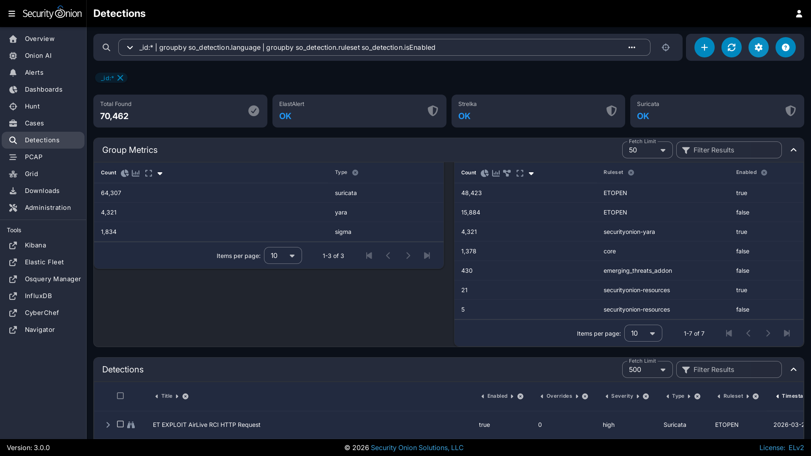
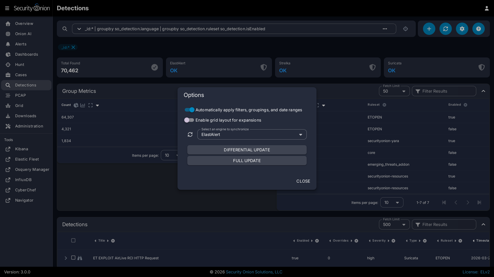
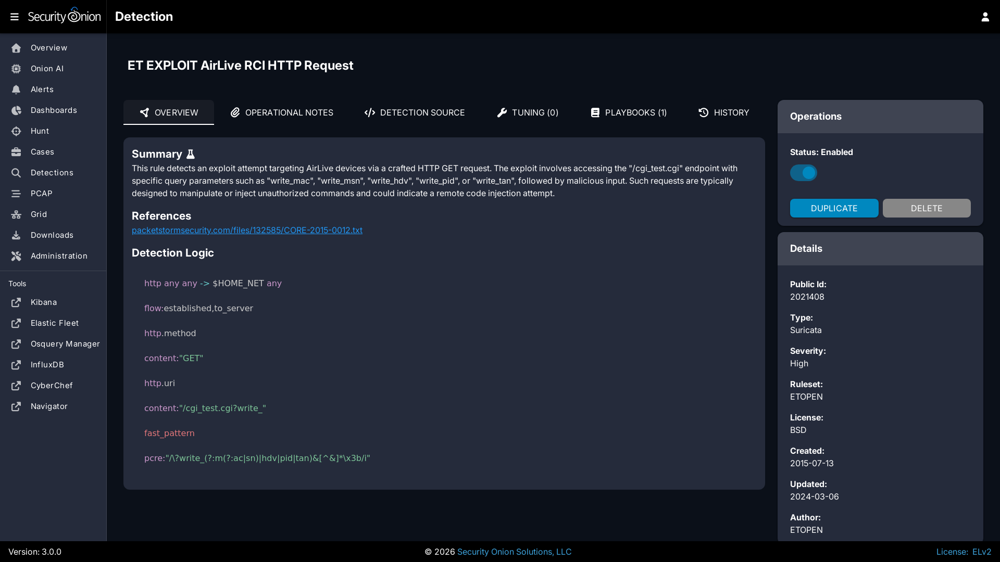
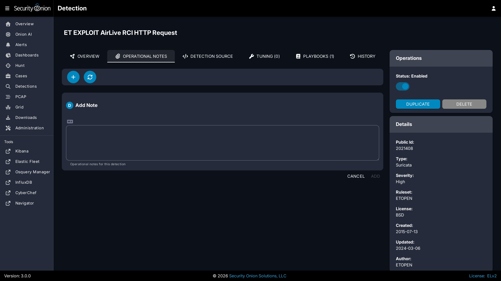
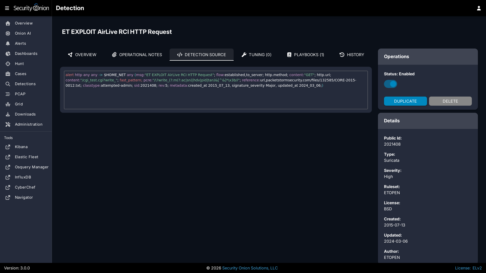
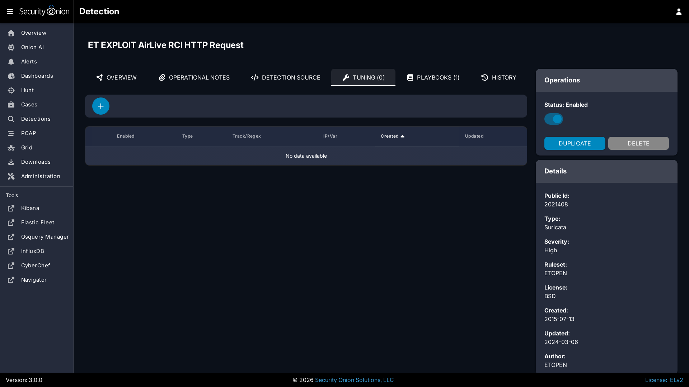
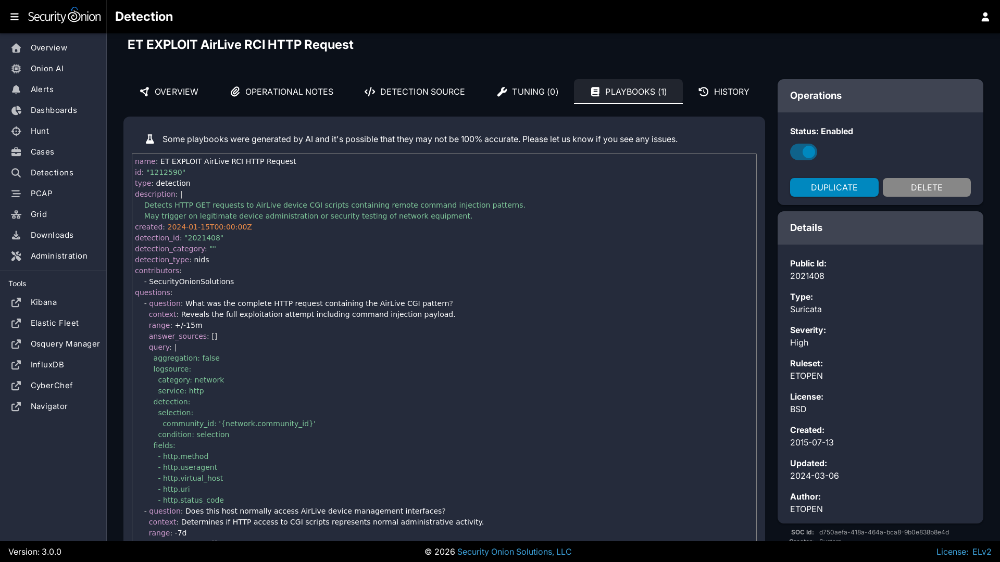
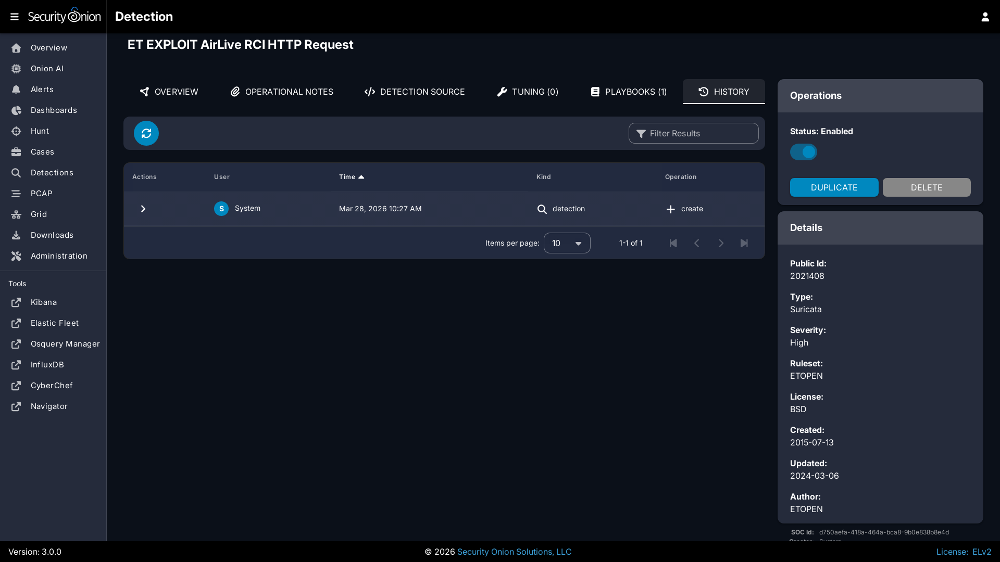

# Detections

[Security Onion Console](security-onion-console.md) includes our Detections interface for managing all of your rules:

- [NIDS](nids.md) rules that get loaded into [Suricata](suricata.md)
- [Sigma](sigma.md) rules that get loaded into [ElastAlert](elastalert.md)
- [YARA](yara.md) rules that get loaded into [Strelka](strelka.md)

!!! NOTE
    
    Check out our Detections video at [https://youtu.be/DelAmqtU2hg](https://youtu.be/DelAmqtU2hg)!

## Rule Engine Status

The upper-right corner shows a count of detections that matched the search query. To the left of that is a status indicator for each of the detection engines. The status can show whether a sync is in process, as well as whether the engine has detected errors. 

Here is the list of possible status messages and what they mean:

- **Pending**: The browser is waiting for the server to send an initial status report.
- **Import Pending**: The import will start once the system stabilizes, usually within twenty minutes. 
- **Importing**: The previous version of Security Onion's rules are being imported into the new Detections system. This can take an hour or more on some systems.
- **Migrating**: Rules will be migrated between Security Onion versions following system upgrades. This can take some time if upgrading from a much older version.
- **Migration Failed**: A failure occurred during the migration. The migration will stop on the first error and will not attempt to migrate to newer versions until the issue is resolved.
- **Synchronizing**: A rule synchronization is in progress. This occurs daily, to ensure the Security Onion Grid has the latest rules. 
- **Sync Failed**: A failure occurred during the synchronization procedure. The next sync will retry within a few minutes.
- **Sync Blocked**: Rule synchronization is currently blocked.
- **Rule Mismatch**: An integrity check process detected a mismatch between the deployed rules and the enabled rules. The SOC log will note the specific mismatched rules. One possible reason is that [Elasticsearch](elasticsearch.md) has reached its disk watermark setting and is no longer allowing updates to the Detections indices.
- **OK**: No known issues with the rule engine.

!!! TIP
    
    Clicking the status text will navigate to [Hunt](hunt.md) and attempt to find related logs. If the status is reporting some kind of failure, then you might want to use [Hunt](hunt.md) to hone in on things like `integrity check failed` or other errors.

As part of the sync process, Detections checks for duplicates. If duplicates are found, Detections will log information about the duplicate.

The Detections menu option on the left side of the application will show an exclamation mark if there is a recent failure in any of the detection engines. In this situation the web browser tab will also show an exclamation indicator. If no failures are detected, and if any of the detection engines has an import pending or is performing a rule import, synchronization, or migration, then a blue hourglass will appear next to the Detections menu option.

## Options

The Options menu allows you to synchronize a particular detection engine such as [ElastAlert](elastalert.md), [Strelka](strelka.md), or [Suricata](suricata.md). 

Once you've selected the detection engine that you want to synchronize, you can then click either the `DIFFERENTIAL UPDATE` or `FULL UPDATE` button. 

The differential update is a lightweight sync that will skip the thorough sync and comparison of each individual rule. For example, with [Suricata](suricata.md) it will compute and compare the hash of the source rule list with the hash of the deployed rules, and only if there's a mismatch will it perform the full sync. 

A full sync can involve inspecting and comparing individual rules, of which there can be thousands. This more thorough sync can take much longer than the differential sync. Note that each engine has its own unique synchronization process.

## Query Bar

The query bar defaults to `All Detections`. Clicking the drop-down box reveals other options such as `Custom Detections`, `All Detections - Enabled`, and `All Detections - Disabled`.

Under the query bar, you’ll notice colored bubbles that represent the individual components of the query. If you want to remove part of the query, you can click the X in the corresponding bubble to remove it and run a new search.

If you would like to save your own personal queries, you can bookmark them in your browser. If you would like to customize the default queries for all users, please see the [SOC Customization](security-onion-console-customization.md) section.

## Group Metrics

The Group Metrics section of output consists of one or more data tables or visualizations that allow you to stack (aggregate) arbitrary fields.

## Data Table

The remainder of the main Detections page is a data table that shows a high level overview of the detections matching the current search criteria.

- Clicking the table headers allows you to sort ascending or descending.
- Clicking a value in the table brings up a context menu of actions for that value. This allows you to refine your existing search or copy text to the clipboard.
- You can adjust the Rows per page setting in the bottom right and use the left and right arrow icons to page through the table.
- When you click the arrow to expand a row in the data table, it will show the high level fields from that detection. Field names are shown on the left and field values on the right. You can click on values on the right to bring up the context menu to refine your search.
- To the right of the arrow is a binoculars icon. Clicking this will take you to the detection details page.

## Detection Details

There are two ways to reach the detail page for an individual detection:

- From the main [Detections](detections.md) interface, you can search for the desired detection and click the binoculars icon.
- From the [Alerts](alerts.md) interface, you can click an alert and then click the `Tune Detection` menu item.

Once you've used one of these methods to reach the detection detail page, you can check the Status field in the upper-right corner and use the slider to enable or disable the detection.

To the left of the Status field are several tabs. 

The OVERVIEW tab displays the Summary, References, and Detection Logic for the detection. The Summary field may contain an AI summary of the rule if one is available. These AI summaries are pre-generated so nothing is ever sent from your system to generate this information. That also means that AI summaries only exist for our default rules and will not exist for any of your custom rules.

The OPERATIONAL NOTES tab allows you to add your own local notes to the detection in markdown format.

The DETECTION SOURCE tab shows the full content of the detection.

The TUNING tab allows you to tune the detection. For [NIDS](nids.md) rules, you can modify, suppress, or threshold. For [Sigma](sigma.md) rules, you can create a custom filter.

The PLAYBOOKS tab shows any applicable plays for this detection. These playbooks are used for the Guided Analysis tab in [Alerts](alerts.md).

!!! WARNING
    
    Some playbooks were generated by AI and it's possible that they may not be 100% accurate. Please let us know if you see any issues.

The HISTORY tab shows the history of the detection since it was added to your deployment.

## More Information

For more information about managing [NIDS](nids.md) rules for [Suricata](suricata.md), please see the [NIDS](nids.md) section.

For more information about managing [Sigma](sigma.md) rules for [ElastAlert](elastalert.md), please see the [Sigma](sigma.md) section.

For more information about managing [YARA](yara.md) rules for [Strelka](strelka.md), please see the [YARA](yara.md) section.

## Technical Background

Detections abstracts the underlying alerting engine and simplifies writing detections for different rule types. Here's what happens behind the scenes.

### Enable and Disable (Bulk and Individual) Operations

ElastAlert/Sigma
  - Immediate change in the UI and on disk

Suricata/NIDS
  - UI Bulk and Individual: Immediate change in the UI and on disk
  - Regex: UI and disk change once the [Suricata](suricata.md) engine syncs

Strelka/YARA
  - Immediate change in the UI, disk change once the `Strelka` state runs again

### Tuning

ElastAlert/Sigma
  - Immediate change in the UI and on disk

Suricata/NIDS
  - Immediate change in the UI and on disk

Strelka/YARA
  - N/A

### Ruleset Changes

ElastAlert/Sigma
  - Sigma Ruleset Packages: UI and disk change once the `SOC` state runs again and the [ElastAlert](elastalert.md) engine syncs
  - Git repo (https or disk): UI and disk change once the `SOC` state runs again and the [ElastAlert](elastalert.md) engine syncs

Suricata/NIDS
  - All ruleset sources (ETOPEN, ETPRO, custom URL, local directory): UI and disk change once the [Suricata](suricata.md) engine syncs

Strelka/YARA
  - Git repo (https or disk): UI and disk change once the `SOC` state runs again and the [Strelka](strelka.md) engine syncs
