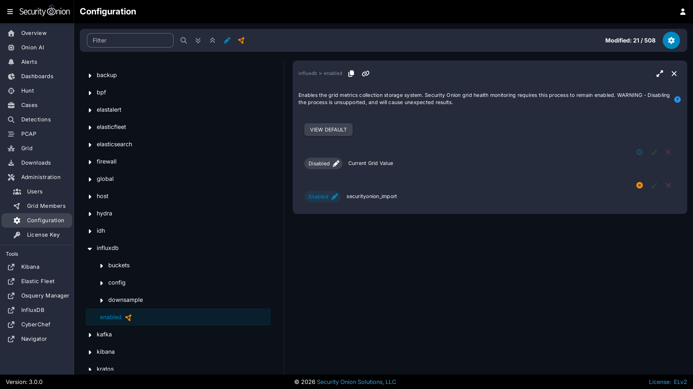
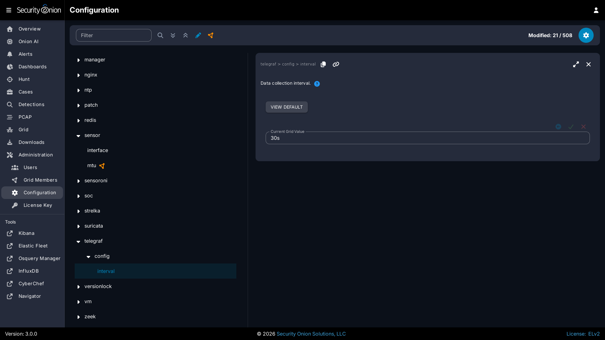

# InfluxDB

[Security Onion Console](security-onion-console.md) includes a link on the sidebar that takes you to InfluxDB.

From <https://github.com/influxdata/influxdb>:

> InfluxDB is an open source time series platform. This includes APIs for storing and querying data, processing it in the background for ETL or monitoring and alerting purposes, user dashboards, and visualizing and exploring the data and more. 

## Authentication

Log into InfluxDB using the same username and password that you use for [SOC](security-onion-console.md).

If you need to reset your InfluxDB password, you can reset your [SOC](security-onion-console.md) password via the [Administration](administration.md) interface which will also update your InfluxDB password.

## Configuration

You can configure InfluxDB by going to [Administration](administration.md) --> Configuration --> influxdb.

You can configure Telegraf by going to [Administration](administration.md) --> Configuration --> telegraf.

## More Information

!!! NOTE
    
    For more information about InfluxDB, please see <https://github.com/influxdata/influxdb>.
