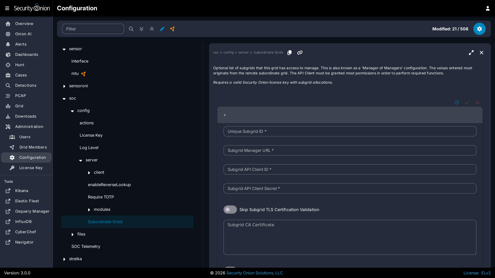

# Manager of Managers

!!! NOTE
    
    This is an enterprise-level feature of Security Onion. Contact Security Onion Solutions, LLC via our website at <https://securityonion.com/pro> for more information about purchasing a [Security Onion Pro](security-onion-pro.md) license with the necessary subgrid allocations to use this feature.

If you are an enterprise customer responsible for managing multiple grids, then you may benefit from the Manager of Managers feature!

This feature allows you to elect a special grid manager (MoM) to be configured with knowledge of remote grids (subgrids) allowing the MoM to reach out to the subgrid to query and/or modify Grid state, events, configuration, etc.

Appropriately privileged users logging into the MoM will be able to interact with those subgrids from a single user interface. A Subgrid selection list will be available in the top-right of the [SOC](security-onion-console.md) UI. Users can choose which Grid they would like to interact with. Additionally, fault states will automatically propagate up to the MoM user interface giving those users the quick updates of new fault states within subgrids, regardless of which subgrid is currently selected. If the subgrid list becomes disabled that will indicate the current screen does not support subgrid interaction.

Users logging into a subgrid [SOC](security-onion-console.md) user interface will have no knowledge or visibility into other sibling grids or the MoM Grid.

## MoM Requirements

The Manager of Managers feature has been designed such that only the MoM Grid node requires network access to the subgrid manager nodes. This simplifies network and firewall configuration by ensuring end-user connections are isolated to a single endpoint. Therefore, users logged into the MoM [SOC](security-onion-console.md) only need web access to the MoM manager.

Please note that Manager of Managers is intended for production deployments so it is only supported on MANAGER, MANAGERSEARCH, and STANDALONE installations. It is not supported for IMPORT or EVAL installations.

## Data Isolation

In a Manager of Managers configuration the data from each subgrid resides at rest within the subgrid only. If a MoM user requests information of a subgrid then that returned data will transit through the MoM node and from there move to the user's web browser.

!!! NOTE
    
    Manager of Managers currently does not attempt to merge data from multiple grids into a single [SOC](security-onion-console.md) view.
    
    The suggested method for accessing data across multiple grids, such as when searching for alerts across all grids, is to utilize cross-cluster search (CCS). Keep in mind that this should be configured such that internal Security Onion indices are excluded from CCS, otherwise there is a risk of data duplication and/or corruption of internal [SOC](security-onion-console.md) entities such as Cases, Detections, etc.

## Subgrid Outages

The MoM node will expect all subgrids to be reachable. In the event a subgrid is not reachable, or is in a state where it cannot respond successfully to incoming MoM requests, the MoM [SOC](security-onion-console.md) interface will display an error notifying the logged in users that it cannot complete the request. Subgrid outages could delay retrieving state information from other subgrids.

If a subgrid is expected to remain in a disconnected state for a longer period it is recommended to disable that subgrid in the Configuration screen and then synchronize the MoM Grid state. This scenario can occur more frequently with subgrid "kits" that are transported between field locations for forensic collection purposes.

## Configuration

!!! WARNING
    
    Do not proceed with the configuration step until an appropriate [Security Onion Pro](security-onion-pro.md) license has been applied to each Grid. Configuring subgrids on a [Security Onion Pro](security-onion-pro.md) license that does not have sufficient subgrid allocations can cause that license to be exceeded which can disable all other Pro features.

Configuration of Manager of Managers requires two steps:

1. API Client: Creation of an API Client on each subgrid manager via the subgrid's [Connect](connect-api.md) Client screen
2. Subgrid Config: Configuration of the subgrids on the MoM Configuration screen

### API Client

Create a new, dedicated [Connect](connect-api.md) Client on each subgrid and assign all permissions that the MoM will need to perform the desired functions. For example, if the MoM users will need complete management and visibility (effectively `superuser` access) then grant all permissions. However, if the MoM users will only be monitoring the subgrid health then the API Client permissions can be limited to `read` permission on specific resources, such as `Grid`, `nodes`, etc.

The API Client ID and Secret will be needed on the next step, so ensure those are recorded for each of the subgrids.

While on the API Client screen, click the ⤓ icon to download the Certificate Authority (CA) certificate file. This file is in a text format and the contents will be pasted into the subgrid setting in the next step.

!!! NOTE
    
    Please be aware that any users in the MoM Grid will be able to connect to the subgrid using the permissions defined for the API client. For example, suppose that you create an API client ID in the subgrid called `supermom` and you grant it all permissions. Once the MoM is configured to connect to the subgrid as shown in the next section, then any users in the MoM Grid will connect to the subgrid as `supermom` and have all permissions to the subgrid regardless of whether the user has equivalent permissions in the MoM.

### Subgrid Config

Once the subgrid API Client credentials are known that subgrid can then be added to the MoM's `Subordinate Grids` Configuration screen. 

- As a superuser, log into the MoM [SOC](security-onion-console.md) interface and navigate to [Administration](administration.md) -> Configuration. 
- Find the `SOC > config > server > Subordinate Grids` setting.
- Click the `+` icon to add a new subgrid.
- Give the new subgrid a unique ID that accurately describes this subgrid from the MoM's perspective.
- Enter in the subgrid's Manager URL (reference the subgrid's `base_url` value in this fully formed URL). Ex: `https://mysubgrid`. Note that this URL must be accessible from the MoM Grid node.
- Paste or enter the subgrid's API Client credentials. This refers to the Client API ID and generated secret.
- Paste the subgrid's API Client Certificate Authority (CA) contents into the `Subgrid CA Certificate` field.
- If this subgrid is ready, enable it.

Add additional subgrids as your [Security Onion Pro](security-onion-pro.md) license allows, and then click the green checkmark to save the configuration. 

The configuration will be applied at the next 15-minute interval or you can apply it immediately on the MoM Grid by clicking the `SYNCHRONIZE GRID` button under the `Options` menu.

## Licensing

The Manager of Managers feature requires that all involved grids have a valid [Security Onion Pro](security-onion-pro.md) license applied. 

The MoM Grid will require a special [Security Onion Pro](security-onion-pro.md) license with an allocation of subgrids encoded into the license that meets or exceeds the number of configured subgrids. Exceeding the licensed subgrid allocation will cause the MoM [SOC](security-onion-console.md) to show an "Exceeded" license state which will disable [Security Onion Pro](security-onion-pro.md) features.

Contact Security Onion Solutions, LLC via our website at <https://securityonion.com/pro> for more information about purchasing a [Security Onion Pro](security-onion-pro.md) license with the appropriate subgrid allocations.
