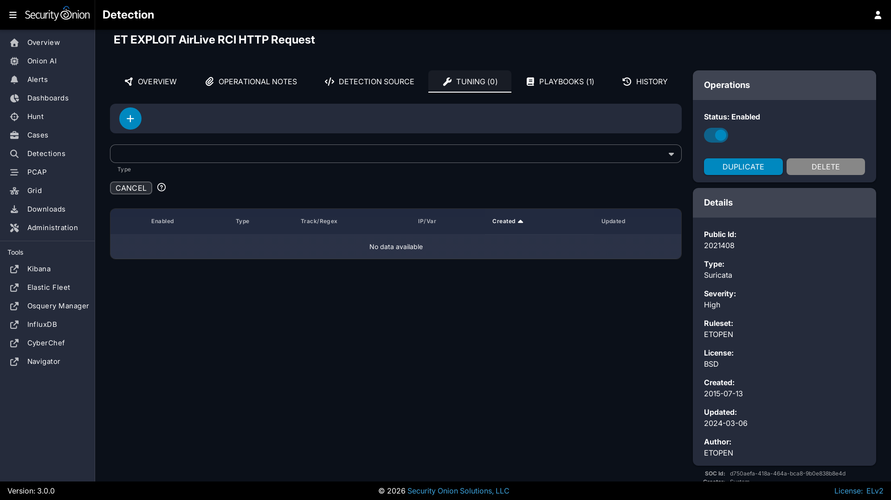

# NIDS

NIDS (Network Intrusion Detection System) rules are loaded into [Suricata](suricata.md) to monitor network traffic for suspicious or noteworthy activity. Active NIDS rules generate alerts that can be found in [Alerts](alerts.md).

## Managing Existing NIDS Rules

You can manage existing NIDS rules using [Detections](detections.md). There are two ways to do so:

- From the main [Detections](detections.md) interface, you can search for the desired detection and click the binoculars icon.
- From the [Alerts](alerts.md) interface, you can click an alert and then click the `Tune Detection` menu item.

Once you've used one of these methods to reach the detection detail page, you can check the Status field in the upper-right corner and use the slider to enable or disable the detection.


To tune the detection:

- Click the Tuning tab
- Click the blue + button
- Select the type of tuning (Modify, Suppress, or Threshold)
- Fill out the requested values
- Click the `CREATE` button



## Enabling and Disabling with Regex

NIDS rules can be enabled or disabled in [Detections](detections.md) using regex patterns. Navigate to SOC [Administration](administration.md) - Configuration and filter for `regex`, then drill down into `SOC` --> `config` --> `server` --> `modules` --> `suricataengine` --> `disableRegex` or `enableRegex`.

The regex flavor is Google RE2: <https://github.com/google/re2/wiki/Syntax>

In ETOPEN, categories are prepended to the rule name. For example, the `ET EXPLOIT PHP-Live-Chat Get Shell Attempt Inbound` rule is in the `ET EXPLOIT` category. So suppose you want to disable the `ET EXPLOIT` and `ET MALWARE` categories but NOT the `ET EXPLOIT_KIT` category. You would use the following regex patterns:


```
ET EXPLOIT\s
ET MALWARE\s
```

The `\s` is a shortcut for whitespace and is useful in this situation to make sure we are only matching the specific categories that we want to disable.

If a detection would be matched by both an enable and disable regex, it is enabled. If a detection's status is changed via the [Detections](detections.md) interface but it is currently matched by a regex pattern, the change initiated from the [Detections](detections.md) interface is reverted and a message is shown.

Enable and disable operations that are based on regex patterns are actioned during the daily rule update. If you have made a change to the regex patterns and would like to have it implemented more immediately:

- Under Grid Configuration, click the `SYNCHRONIZE GRID` button and wait about 5 minutes for it to complete.
- Navigate to [Detections](detections.md), click the Options menu, select [Suricata](suricata.md) in the dropdown menu, click the `FULL UPDATE` button, and then wait for it to complete.
- Refresh the [Detections](detections.md) page and you should see the relevant rule statuses have changed.

!!! NOTE

    If a disable regex is applied to a setter flowbit rule and that rule is still required, it will be written out to the rules file as enabled, but `noalert`

## Tuning Overrides

Overrides allow you to tune rule behavior without modifying the rule itself. Security Onion supports three types of overrides for NIDS rules.

### Threshold Override

The threshold override limits how often a rule generates alerts. Use this when a rule is generating too many alerts and you want to reduce volume without disabling the detection.

Thresholds are written to Suricata's `threshold.conf` file and control alert frequency based on occurrence count and time window.

- **Threshold Type**: `limit`, `threshold`, or `both`

  - `limit`: Alert at most N times per time window
  - `threshold`: Alert only after N occurrences per time window
  - `both`: Alert once per time window after N occurrences

- **Track**: `by_src` or `by_dst` - whether to track per source IP or destination IP
- **Count**: Number of occurrences for the threshold logic (must be > 0)
- **Seconds**: Time window in seconds (must be > 0)

**Example:** Limit alerts to once per hour per source IP:

**Threshold Type:** `limit`
**Track:** `by_src`
**Count:** `1`
**Seconds:** `3600`

**Result in threshold.conf:**

```
threshold gen_id 1, sig_id 2001219, type limit, track by_src, count 1, seconds 3600
```

### Suppress Override

The suppress override silences alerts from specific IP addresses or networks. Use this when a rule generates false positives from known-good sources.

Suppressions are written to Suricata's `threshold.conf` file. When traffic matches the rule and originates from (or is destined to) the specified IP, no alert is generated.

- **Track**: `by_src` or `by_dst` - suppress based on source IP or destination IP
- **IP**: IP address, CIDR network, or Suricata variable (e.g., `192.168.1.100`, `10.0.0.0/8`, or `$SCANNERS`)

**Example:** Suppress alerts from a vulnerability scanner:

**Track:** `by_src`
**IP:** `192.168.50.10`

**Result in threshold.conf:**

```
suppress gen_id 1, sig_id 2001219, track by_src, ip 192.168.50.10
```

**Example:** Suppress using a Suricata variable:

**Track:** `by_src`
**IP:** `$SCANNERS`

**Result in threshold.conf:**

```
suppress gen_id 1, sig_id 2001219, track by_src, ip $SCANNERS
```

### Modify Override

The modify override allows you to change the content of a Suricata rule using regular expression pattern matching. This is useful for tuning rules without creating custom copies.

### How It Works

The modify override applies a regex find-and-replace to the rule content at sync time. The original rule in the database is unchanged; the modification is applied when writing the rules file that Suricata reads.

- **Regex**: A Go-compatible regular expression pattern to match
- **Value**: The literal replacement string

!!! NOTE

    The replacement string is treated as literal text. Backreferences (`\1`, `\2`, etc.) are not supported. If you need to capture part of the match, use multiple specific overrides instead.

### Examples

### Exclude IP Range from Variable

To exclude `$DC_SERVERS` from `$EXTERNAL_NET`:

**Regex:** `\$EXTERNAL_NET`
**Value:** `[$EXTERNAL_NET,!$DC_SERVERS]`

**Before:**

```
alert tcp $EXTERNAL_NET any -> $HOME_NET any (msg:"Example"; sid:1001;)
```

**After:**

```
alert tcp [$EXTERNAL_NET,!$DC_SERVERS] any -> $HOME_NET any (msg:"Example"; sid:1001;)
```

### Change Threshold Seconds

To change a rule's threshold from 60 seconds to 3600:

**Regex:** `seconds \d+`
**Value:** `seconds 3600`

**Before:**

```
alert http any any -> any any (msg:"Test"; threshold:type limit,track by_src,count 1,seconds 60; sid:1001;)
```

**After:**

```
alert http any any -> any any (msg:"Test"; threshold:type limit,track by_src,count 1,seconds 3600; sid:1001;)
```

### Modify Content Match

To change a specific content match value:

**Regex:** `content:"67:98:30`
**Value:** `content:"88:98:30`

**Before:**

```
alert tls any any -> any any (msg:"SSL Cert"; content:"67:98:30:81:90"; sid:1001;)
```

**After:**

```
alert tls any any -> any any (msg:"SSL Cert"; content:"88:98:30:81:90"; sid:1001;)
```

### Limitations

- **No backreferences**: Python-style backreferences (`\1`, `\2`) in the replacement string are not supported. The sync will fail with an error if these are detected.
- **PCRE exception**: Backslash sequences inside `pcre:"..."` sections are allowed, as these are valid PCRE syntax.
- **Literal replacement**: The replacement value is always treated as literal text. Special regex characters in the replacement do not have special meaning.

## Adding New NIDS Rules

To add a new NIDS rule, go to the main [Detections](detections.md) page and click the blue + button between Options and the query bar. A form will appear where you will:

1. Click the Language drop-down and select `Suricata`.
2. Optionally specify a license.
3. Add the signature.
4. Click the `CREATE` button and the detection should deploy to your grid at the next 15-minute cycle.


## Update Frequency

By default, Security Onion checks for new NIDS rules every 24 hours. You can change this value as follows:

- Navigate to [Administration](administration.md) --> Configuration.
- At the top of the page, click the `Options` menu and then enable the `Show advanced settings` option.
- Navigate to `SOC` --> `config` --> `server` --> `modules` --> `suricataengine` --> `communityRulesImportFrequencySeconds`.

## Allow External Access to NIDS Rules

You can enable external access to NIDS rules managed by [Detections](detections.md). This is useful when configuring [OPNsense](opnsense.md) or other network devices to pull NIDS rules from your Security Onion deployment. You can do this as follows:

- Navigate to [Administration](administration.md) --> Configuration.
- At the top of the page, click the `Options` menu and then enable the `Show advanced settings` option.
- Navigate to Nginx --> config --> external_suricata.
- On the right side of the page, change the value to `true` and then click the checkmark to save the new setting.
- You can wait for the next Grid update or click the `SYNCHRONIZE GRID` button under Options.
- Once the grid is fully synchronized, the Manager should listen on port 7789 for https connections from hosts defined in the `external_suricata` host group.

## Configuring Rulesets

Security Onion allows you to configure multiple NIDS rulesets. You can manage these rulesets by navigating to [Administration](administration.md) --> Configuration --> `SOC` --> `config` --> `server` --> `modules` --> `suricataengine` --> `rulesetSources`. This setting is also available via the Configuration quicklinks.

There are two configuration profiles:

- **`default`**: Used for standard (non-Airgap) deployments
- **`airgap`**: Used for [Airgap](airgap.md) deployments

If your system is in Airgap mode, the Airgap configuration profile will automatically be used - otherwise the default is in use. 

Within this configuration, you can enable additional rulesets, add custom rulesets, or disable existing ones. When you save a ruleset configuration change and apply the SOC state, Security Onion will detect the change and automatically sync all configured rulesets within 15 minutes.

OISF-maintained list of Suricata-compatible rulesets: <https://github.com/OISF/suricata-intel-index>

!!! NOTE
    
    Each ruleset must have a unique name. Duplicate names will cause sync failures.

### Ruleset Configuration Options

Each ruleset source has the following configuration options:

- **Ruleset Name**: Required. The unique name for this ruleset (e.g., "Emerging-Threats", "ABUSECH-SSLBL", "local-rules"). This is the name displayed in the UI.
- **Description**: Optional description of the ruleset.
- **Enabled**: Required. If set to false, existing rules and overrides from this ruleset will be removed.
- **License Key**: Optional. Required for commercial rulesets like ET Pro.
- **Source Type**: Required. Either `url` (downloads rules from HTTPS) or `directory` (reads rules from local filesystem).
- **Source Path**: Required. The full URL or directory/file path depending on Source Type. See [Supported Source Path Formats](#supported-source-path-formats) below.
- **Exclude Files**: Optional. List of rule file names to exclude, separated by commas (e.g., `*deleted*, *retired*`).
- **Ruleset License**: Required. The license type for this ruleset (e.g., "BSD", "Commercial", "CC0-1.0").
- **Read Only**: Optional, defaults to false. When enabled, prevents modification of rule content via the UI - users can still enable/disable rules and add tuning overrides (suppress, threshold, modify). Use this for vendor-managed rulesets where you want to preserve the original rule text.
- **Delete Unreferenced**: Optional, defaults to false. Controls what happens to rules in Elasticsearch when they are removed from the source.

  - **false** (default): Rules removed from the source remain in Elasticsearch. This preserves user modifications and prevents accidental data loss.
  - **true**: Rules removed from the source are automatically deleted from Elasticsearch. Use this when the source is authoritative (e.g., git-managed rulesets).

!!! WARNING
    
    Changing this setting from `false` to `true` will delete any rules that no longer exist in the source. If you have orphaned rules (rules in ES but not in source), they will be permanently removed on the next sync.

### Supported Source Path Formats

For **url** Source Type:

- URL to a `.rules` file (e.g., `https://rules.emergingthreats.net/open/suricata-7.0.3/emerging-all.rules`)
- URL to a `.tar.gz` archive (e.g., `https://rules.emergingthreats.net/open/suricata-7.0.3/emerging-all.rules.tar.gz`)

For **directory** Source Type:

- Directory containing multiple `.rules` files (e.g., `/nsm/rules/custom-local-repos/local-Suricata-import/`)
- Directory containing a single `.rules` file
- Direct path to a `.rules` file (e.g., `/nsm/rules/custom-local-repos/local-Suricata-import/import.rule`)
- Direct path to a `.tar.gz` archive (e.g., `/nsm/rules/custom-local-repos/local-Suricata-import/import.tar.gz`)

### URL Source Options

When using `url` as the Source Type, additional options are available:

- **URL Hash**: URL to a hash file (.md5 or .sha256) for verifying the downloaded ruleset.
- **Proxy URL**: HTTP/HTTPS proxy URL for downloading the ruleset. (e.g., `http://192.168.1.50:3128`)
- **Proxy Username**: Proxy authentication username.
- **Proxy Password**: Proxy authentication password.
- **Proxy CA Path**: Path to CA certificate file for MITM proxy verification (e.g., `/opt/so/saltstack/local/salt/suricata/files/ruleset_ca.crt`)

### Default Rulesets

Emerging Threats (ET Open / ET Pro)
  Security Onion includes the Emerging Threats Open ruleset by default. To switch to ET Pro (commercial), edit the Emerging-Threats ruleset and enter your license key in the License Key field. Click the green checkmark to save, then apply the SOC state. Leave the License Key empty for ET Open (free) rules.

  - Optimized for [Suricata](suricata.md)
  - ET Open is **free**, ET Pro requires a license fee per sensor

  For more information, see:
  - <https://rules.emergingthreats.net/open/>
  - <https://www.proofpoint.com/us/threat-insight/et-pro-ruleset>

Abuse.ch SSL Blacklist (ABUSECH-SSLBL)
  SSL certificate blacklist from Abuse.ch. Only available in non-Airgap, disabled by default.

  For more information, see:
  - <https://sslbl.abuse.ch/>

Local Rules
  A directory-based ruleset source for custom local rules. Rules are read from `/nsm/rules/custom-local-repos/local-Suricata`. This ruleset is enabled by default with Read Only set to false, allowing you to edit rules directly once they are imported. Keep in mind that if the local .rules file remains on disk in this location, each sync will attempt to re-import the rules and potentially overwrite any changes made within the web interface.

### Suricata Metadata Rulesets

When Suricata is configured as the metadata engine (instead of [Zeek](zeek.md)), two additional rulesets become available:

SO_EXTRACTIONS
  Extraction rules that control which file types Suricata extracts from network traffic for analysis by [Strelka](strelka.md). This ruleset is imported and **enabled by default** when Suricata is the metadata engine.

SO_FILTERS
  Filter rules that control which metadata Suricata logs. Use these to reduce unnecessary metadata logging. This ruleset is imported but **disabled by default** when Suricata is the metadata engine.

## Common Ruleset Configurations

This section provides configuration examples for common deployment scenarios.

## ET Pro in Airgap Environments

For Airgap deployments using ET Pro (commercial) rules, you must manually transfer the ruleset to your Security Onion Manager since it cannot download from the internet.

**Prerequisites:**

- Valid ET PRO license key
- A system with internet access to download the ruleset

**Procedure:**

- **Download the ET PRO ruleset (on internet-connected system)**

  Use your license key to download the latest ruleset:

  ```bash
  # Replace YOUR_LICENSE_KEY with your actual ET PRO license key
  curl -o etpro.rules.tar.gz \
    "https://rules.emergingthreatspro.com/YOUR_LICENSE_KEY/suricata-7.0.3/etpro.rules.tar.gz"
  ```

- **Transfer to Airgapped Manager**

  Use your approved file transfer method to copy the archive to the Manager node.

- **Place the ruleset on the Manager**

  Copy the archive to a directory accessible by SOC:

  ```bash
  sudo cp etpro.rules.tar.gz /nsm/rules/custom-local-repos/local-etpro-Suricata/
  sudo chown -R socore:socore /nsm/rules/custom-local-repos/local-etpro-Suricata
  ```

- **Configure the ruleset source**

  Navigate to [Administration](administration.md) --> Configuration --> `SOC` --> `config` --> `server` --> `modules` --> `suricataengine` --> `rulesetSources`.

  Modify the existing `Emerging-Threats` ruleset (recommended):

  - **License Key**: `YOUR_LICENSE_KEY`

  You can also create a new ruleset source (make sure to disable the existing Emerging-Threats ruleset):

  - **Ruleset Name**: `ETPRO-Airgap`
  - **Source Type**: `directory`
  - **Source Path**: `/nsm/rules/custom-local-repos/local-etpro-Suricata/etpro.rules.tar.gz`
  - **Read Only**: `true` (recommended - preserves vendor rule content)
  - **Delete Unreferenced**: `true` (recommended - removes outdated rules when you update the archive)
  - **Ruleset License**: `Commercial`
  - **Enabled**: `true`

- **Apply configuration and sync**

  Save the configuration and apply the SOC state. Then either wait for the next automatic sync (up to 15 minutes) or trigger a manual sync:

  - Navigate to [Detections](detections.md)
  - Click Options menu
  - Select [Suricata](suricata.md) engine
  - Click `FULL UPDATE`

**Updating Rules:**

To update your ET Pro rules in an Airgap environment:

- Download the latest `etpro.rules.tar.gz` on an internet-connected system
- Transfer to the airgapped Manager
- Replace the existing archive:

  ```bash
  sudo cp etpro.rules.tar.gz /nsm/rules/custom-local-repos/local-etpro-Suricata/
  ```

- Wait for the next automatic sync or trigger a manual `FULL UPDATE`

With `Delete Unreferenced: true`, rules that were removed in the new version will be automatically cleaned up from Elasticsearch.

## Flowbit Dependency Handling

### Overview

Suricata rules can use **flowbits** to share state between rules. A common pattern is for one rule to detect an initial condition and "set" a flowbit, while other rules check if that flowbit is set before alerting. This creates a dependency between rules.

Security Onion automatically manages these dependencies to ensure your enabled rules function correctly, even when you disable related rules.

### How Flowbits Work

Flowbits allow rules to communicate within a single network flow:

* **Setter rules** use `flowbits:set,name` to mark a flow
* **Getter rules** use `flowbits:isset,<name>` to check if a flow was marked

For example, a malware detection might work like this:

- **Rule A** (setter): Detects initial malware handshake, sets `flowbits:set,malware.detected`
- **Rule B** (getter): Detects follow-up command, requires `flowbits:isset,malware.detected`

Rule B will only alert if Rule A has already matched on the same flow. If Rule A is disabled, Rule B can never trigger.

### Automatic Dependency Resolution

When you disable a rule that sets a flowbit needed by other enabled rules, Security Onion automatically handles this:

- **Your preference is preserved** - The rule remains marked as "disabled" in Elasticsearch & SOC
- **The rule still runs** - It is included in the active ruleset so dependent rules can function
- **No alerts are generated** - The `noalert` option is automatically added so the disabled rule runs silently

### Example

Consider these rules:

| SID | Rule Name | Flowbit | Your Setting |
|-----|-----------|---------|--------------|
| 2012236 | x0Proto Init | `flowbits:set,et.x0proto` | **Disabled** |
| 2012237 | x0Proto Client Info | `flowbits:isset,et.x0proto` | Enabled |
| 2012238 | x0Proto Pong | `flowbits:isset,et.x0proto` | Enabled |

Even though you disabled rule 2012236, it will still run because rules 2012237 and 2012238 depend on it. However:

* Rule 2012236 will **not** generate alerts
* Rules 2012237 and 2012238 will alert normally when their conditions match

In the rules file, you will see a comment explaining the automatic inclusion:

```
# AUTO-ENABLED (flowbit: et.x0proto, required by 2 rule(s)): This disabled rule runs with noalert
alert tcp $EXTERNAL_NET any -> $HOME_NET any (msg:"x0Proto Init"; ... noalert; sid:2012236; ...)
```

### When Disabled Rules Are Excluded

A disabled setter rule is only auto-enabled if at least one getter rule depends on it. If you disable **all** rules that check a particular flowbit, the setter rule will be excluded from the active ruleset entirely.

Using the example above, if you disable all three rules (2012236, 2012237, and 2012238), then rule 2012236 will not be included in the rules file since no enabled rules need its flowbit.

## Sync Block

For the upgrade to 2.4.200, the dependency on idstools has been removed and all functionality has been moved directly into SOC. Because of the complexity of this change, if SOUP detects a non-default Suricata ruleset configuration, it creates a block file that stops any further Suricata ruleset changes until the block file has been removed.

!!! WARNING
    
    This block is critical because if the Suricata rulesets are synced without the configuration properly migrated, all current rules and overrides in SOC Detections will be removed and will need to be recreated.

To resolve this block, use the following procedure:

- **Review the `syncBlock` file**

  Login to the Manager and view the `syncBlock` file to see what non-default configuration was detected:

  ```bash
  sudo cat /opt/so/conf/soc/fingerprints/suricataengine.syncBlock
  ```

  Example output showing ET Pro was detected:

  ```
  Suricata ruleset sync is blocked until this file is removed.
  **CRITICAL** Make sure that you have manually added any custom Suricata
  rulesets via SOC config before removing this file - review the documentation
  for more details: <https://securityonion.net/docs/nids#sync-block>
  Custom so-rule-update detected (hash: 207d8918a2d963bb7dcc0f1ebf28d6f7b5778019fedf0cc36d5d0850cbd8a529)
  ET Pro code found: YOUR_LICENSE_KEY
  ```

  Note any license codes or custom configurations mentioned - you will need to enter these in the next step.

- **Configure Suricata rulesets in SOC**

  Navigate to SOC Configuration:

  - [Administration](administration.md) --> Configuration --> Quicklinks --> **Configure NIDS Rulesets**

  There are two configuration profiles:

  - **`default`**: Used for standard (non-Airgap) deployments
  - **`airgap`**: Used for [Airgap](airgap.md) deployments

  Select the appropriate profile for your environment.

  **For ET Pro configurations - Non-Airgap:**

  - Find the `Emerging-Threats` ruleset entry
  - Copy and paste your ET Pro license code (shown in the syncBlock file) into the `License Key` field

  **For ET Pro configurations - Airgap:**

  Following the procedure outlined here: [ET Pro in Airgap Environments](#et-pro-in-airgap-environments)

  During this migration, it is important to use the built-in `Emerging Threats` Airgap config profile.

  **For proxy configurations:**

  If your environment requires a proxy to download rulesets, configure the proxy settings on the ruleset entry:

  - **Proxy URL**: Your proxy server URL (e.g., `http://192.168.1.50:3128`)
  - **Proxy Username** / **Proxy Password**: If proxy authentication is required
  - **Proxy CA Path**: Path to CA certificate if using a MITM proxy

  **For custom rulesets:**

  If you had custom rulesets configured, add new ruleset entries with the appropriate Source Type, Source Path, and other settings. See [Configuring Rulesets](#configuring-rulesets) for details.

- **Save and synchronize configuration**

  - Click the green checkmark to save your changes
  - Click `SYNCHRONIZE SOC` and wait for it to complete

- **Remove the syncBlock file**

  Once the configuration is saved and synchronized, remove the block file:

  ```bash
  sudo rm /opt/so/conf/soc/fingerprints/suricataengine.syncBlock
  ```

- **Trigger a full ruleset sync**

  - Navigate to [Detections](detections.md)
  - Click the `Options` menu
  - In the engine dropdown, select `Suricata`
  - Click `FULL UPDATE`

- **Verify successful sync**

  Within a minute or so, you should see a success message: `Synchronized Suricata rules successfully.`

  The engine status indicator should clear to `OK`.

  If the sync fails, click the `Sync Failure` crosshair icon in the top-right corner of the Suricata engine to view the error details.