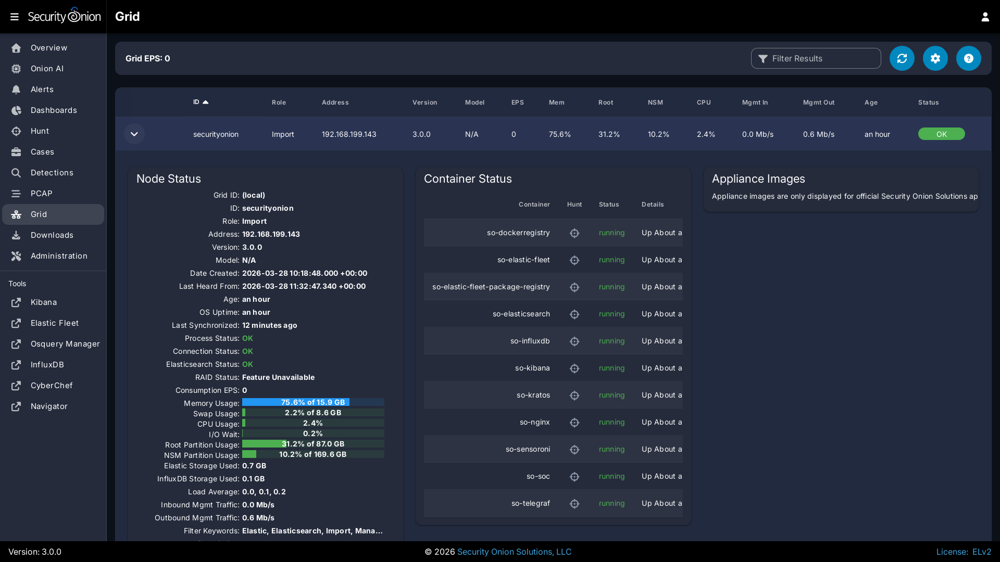

# Post Installation

## Adjust firewall rules

Depending on what kind of installation you did, the Setup wizard may have already walked you through adding firewall rules to allow your analyst IP address(es). If you need to make other adjustments to firewall rules, you can do so by going to [Administration](administration.md) --> Configuration --> firewall --> hostgroups.


If for some reason you can't access [SOC](security-onion-console.md) at all, you can use the so-firewall command to allow the IP address of your web browser to connect (replacing `<IP ADDRESS>` with the actual IP address of your web browser):

```
sudo so-firewall includehost analyst <IP ADDRESS>
```

For more information, please see the [Firewall](firewall.md) section.

## Services

You can check the [Grid](grid.md) page to see if all services are running correctly.



!!! NOTE
    
    Please note that new nodes start off showing a red Fault and may take a few minutes to fully initialize before they show a green OK.

You can also verify services are running from the command line with the [so-status](so-status.md) command:

```
sudo so-status
```
	
## SSH

You should be able to do most administration from [SOC](security-onion-console.md) but if you need access to the command line then we recommend using [SSH](ssh.md) rather than the [Console](console.md).

## Data

-  Review the [Elasticsearch](elasticsearch.md) section to see if you need to change any of the default settings. In particular, if you have a multi-node deployment with one or more search nodes, we HIGHLY recommend configuring ILM to delete indices before Elasticsearch reaches its watermark setting and stops ingesting new data.

-  Review the [Full Packet Capture](full-packet-capture.md) and [Suricata](suricata.md) sections to see if you need to change the PCAP retention settings.

## Other

-  Go to [Administration](administration.md) and then click Configuration to see some of the options that you may want to configure. For example, you may want to enable reverse DNS lookups when viewing IP addresses in [SOC](security-onion-console.md). For more information, please see the [SOC Customization](security-onion-console-customization.md) section.

-  While on the [Administration](administration.md) page, you may want to set your preferred [NTP](ntp.md) server.

-  Full-time analysts may want to connect using a dedicated [Security Onion Desktop](security-onion-desktop.md).

-  Any IDS/NSM system needs to be tuned for the network it’s monitoring. Please see the [Detections](detections.md) and [Rules](rules.md) sections.
