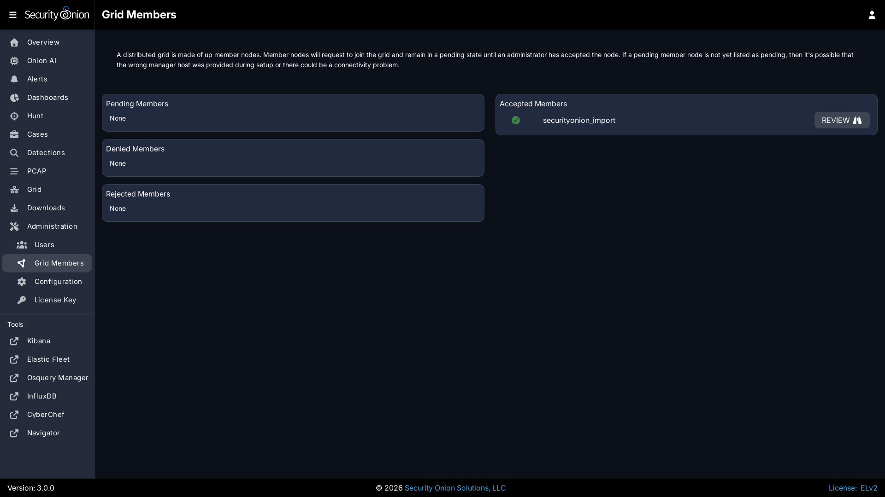

# Removing a Node

There may come a time when you need to remove a node from your distributed deployment. To do this, you'll need to remove the node's configuration from a few different components.

## Removing a Search Node

To remove a search node, the data stored on the node needs to be migrated off before other node removal actions.

Use the following command in [Kibana](kibana.md) Dev Tools to stop shard allocation to the node (replacing 10.0.0.1 with the actual IP address of the search node to be removed):


```json
PUT _cluster/settings
{
  "persistent" : {
    "cluster.routing.allocation.exclude._ip" : "10.0.0.1"
  }
}
```

For more information about this command, please see <https://www.elastic.co/guide/en/elasticsearch/reference/current/modules-cluster.html#cluster-shard-allocation-filtering>.

Once all data has migrated off the search node, then you can continue with other node removal actions. 

## Removing from Salt

You can remove a node from [Salt](salt.md) by going to [Administration](administration.md) --> Grid Members. 



Find the grid Member you would like to remove, click the `REVIEW` button, and then click the `DELETE` button.

## Removing from SOC

To remove the node from the SOC [Grid](grid.md) page, make sure the node is powered off and then restart SOC:


```
sudo so-soc-restart
```

## Removing from Fleet

To remove the node from [Elastic Fleet](elastic-fleet.md), go to the Agents tab and find the node. Then click the checkbox to the left of the node. Click the `Actions` button and then click `Unenroll 1 agent`. Select the `Remove agent immediately` option and then click the `Unenroll agent` button.