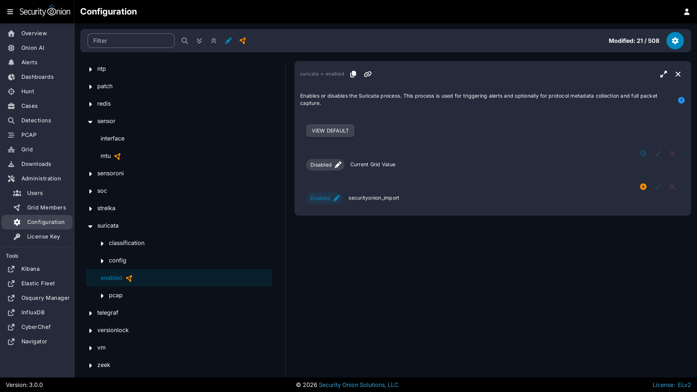
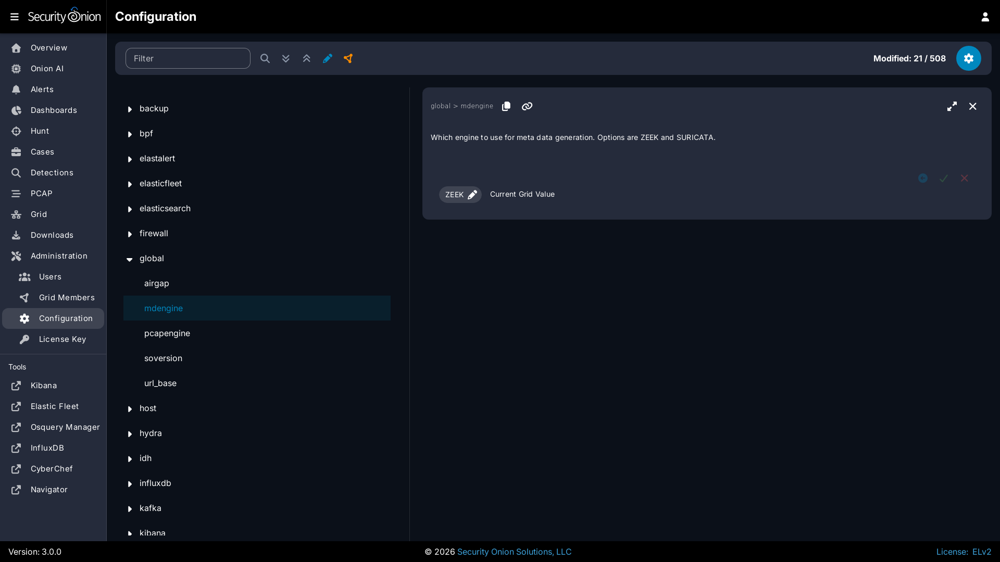

# Suricata

From <https://suricata.io>:

> Suricata is a free and open source, mature, fast and robust network threat detection engine. Suricata inspects the network traffic using a powerful and extensive rules and signature language, and has powerful Lua scripting support for detection of complex threats.

Suricata [NIDS](nids.md) alerts can be found in [Alerts](alerts.md), [Dashboards](dashboards.md), [Hunt](hunt.md), and [Kibana](kibana.md). 

Here's an example of Suricata [NIDS](nids.md) alerts in [Alerts](alerts.md):


If enabled, Suricata metadata (protocol logs) can be found in [Dashboards](dashboards.md), [Hunt](hunt.md), and [Kibana](kibana.md).

## Community ID

Security Onion enables Suricata's built-in support for [Community ID](community-id.md).

## VLAN Tags

If your network traffic has VLAN tags, then Suricata will log them. [Dashboards](dashboards.md) has a VLAN dashboard which will show this data.

If your network traffic has mixed VLAN tags (VLAN tags in one direction but not the other), then you may need to do the following:

- Navigate to [Administration](administration.md) --> Configuration.
- At the top of the page, click the `Options` menu and then enable the `Show advanced settings` option.
- Navigate to Suricata > config > vlan > use-for-tracking and set it to `false`.

## Configuration

You can configure Suricata by going to [Administration](administration.md) --> Configuration --> Suricata.



If you would like to configure [NIDS](nids.md) rules, take a look at the [Detections](detections.md) interface.

## HOME_NET

The HOME_NET variable defines the networks that are considered home networks (those networks that you are monitoring and defending). The default value is RFC1918 private address space (10.0.0.0/8, 192.168.0.0/16, and 172.16.0.0/12). You can modify this default value by going to [Administration](administration.md) --> Configuration --> Suricata --> config --> vars --> address-groups --> HOME_NET.

## EXTERNAL_NET

By default, EXTERNAL_NET is set to `any` (which includes `HOME_NET`) to detect lateral movement inside your environment. You can modify this default value by going to [Administration](administration.md) --> Configuration --> Suricata --> config --> vars --> address-groups --> EXTERNAL_NET.

## Stats

For Suricata statistics, see [Grid](grid.md), [InfluxDB](influxdb.md), and `/opt/so/log/suricata/stats.log`.

## Performance

If [Grid](grid.md) shows that Suricata is experiencing packet loss, then you may need to do one or more of the following:

- Tune the [NIDS](nids.md) ruleset.
- Apply a [BPF](bpf.md).
- Adjust `max-pending-packets` in [Administration](administration.md) --> Configuration --> Suricata --> config --> max-pending-packets.
- Adjust [AF-PACKET](af-packet.md) workers in [Administration](administration.md) --> Configuration --> Suricata --> config --> af-packet --> threads.

!!! NOTE
    
    For other tuning considerations, please see:
    <https://suricata.readthedocs.io/en/latest/performance/tuning-considerations.html>

If you have multiple physical CPUs, you’ll most likely want to pin sniffing processes to a CPU in the same Non-Uniform Memory Access (NUMA) domain that your sniffing NIC is bound to.  Accessing a CPU in the same NUMA domain is faster than across a NUMA domain.  

!!! NOTE
    
    For more information about determining NUMA domains using `lscpu` and `lstopo`, please see:
    <https://github.com/brokenscripts/cpu_pinning>

## Metadata

By default, Security Onion uses [Zeek](zeek.md) to record protocol metadata. If you don't need all of the protocol coverage that [Zeek](zeek.md) provides, then you can switch to Suricata metadata to save some CPU cycles. If you choose to do this, then here are some of the kinds of metadata you can expect to see in [Dashboards](dashboards.md) or [Hunt](hunt.md):

-  Connections
-  DHCP
-  DNS
-  Files
-  FTP
-  HTTP
-  SSL

If you later find that some of that metadata is unnecessary, you can enable the SO_FILTERS ruleset to filter out unnecessary metadata. Navigate to [Administration](administration.md) --> Configuration --> SOC --> config --> server --> modules --> suricataengine --> rulesetSources and enable the SO_FILTERS ruleset.

To change your grid's metadata engine from [Zeek](zeek.md) to Suricata, go to [Administration](administration.md) --> Configuration --> global --> mdengine and change the value from `Zeek` to `Suricata`:



## File Extraction

If you choose Suricata for metadata, it will extract files from network traffic and [Strelka](strelka.md) will then analyze those extracted files. The SO_EXTRACTIONS ruleset controls which file types are extracted and is enabled by default when Suricata is the metadata engine. You can customize file extraction by modifying rules in this ruleset.

## PCAP

Security Onion uses Suricata for full packet capture. For more information, please see the [Full Packet Capture](full-packet-capture.md) section.

## Diagnostic Logging

If you need to troubleshoot Suricata, check `/opt/so/log/suricata/suricata.log`. Depending on what you’re looking for, you may also need to look at the [Docker](docker.md) logs for the container:

```
sudo docker logs so-suricata
```

## Testing

The first and easiest way to test Suricata is to access <http://testmynids.org/uid/index.html> from a machine that is being monitored by your Security Onion deployment. You can do so via the command line using `curl`:

```
curl testmynids.org/uid/index.html
```

If everything is working correctly, you should see a corresponding alert (`GPL ATTACK_RESPONSE id check returned root`) in [Alerts](alerts.md). You should also be able to find the alert in [Dashboards](dashboards.md) or [Hunt](hunt.md).

If you do not see this alert, try checking to see if the rule is enabled by going to [Detections](detections.md) and searching for the SID of the rule which is `2100498`. One way to search for this rule is to specify it in the URL as follows:

`#/detections?q=2100498`

Another way to test Suricata is with a utility called `tmNIDS`. You can run the tool in interactive mode like this:


```
curl -sSL https://raw.githubusercontent.com/0xtf/testmynids.org/master/tmNIDS -o /tmp/tmNIDS && chmod +x /tmp/tmNIDS && /tmp/tmNIDS
```

Finally, you can also test Suricata alerting by replaying some test PCAP files via [so-test](so-test.md).

## Troubleshooting Alerts

If you're not seeing the Suricata alerts that you expect to see, here are some things that you can check:

- If you have metadata enabled, check to see if you have metadata for the connections. Depending on your configuration, this could be Suricata metadata or [Zeek](zeek.md) metadata. Go to [Dashboards](dashboards.md), click the dropdown menu, select the `Connections seen by Zeek or Suricata` dashboard, and see if the connections you expect to see in your network traffic are listed there.

- If you have metadata enabled but aren't seeing any metadata, then something may be preventing the process from seeing the traffic. Check to see if you have any [BPF](bpf.md) configuration that may cause the process to ignore the traffic. If you're sniffing traffic from the network, verify that the traffic is reaching the NIC using tcpdump. If importing a PCAP file, verify that file contains the traffic you expect and that the Suricata process can read the file and any parent directories.

- Check to see if you have mixed VLAN tags (VLAN tags in one direction but not the other). If so, see the VLAN Tags section above to configure Suricata appropriately.

- Check your HOME_NET configuration to make sure it includes the networks that you're watching traffic for.

- Check to see if you have a full [NIDS](nids.md) ruleset with rules that should specifically alert on the traffic and that those rules are enabled.

- Check to see if you have any threshold or suppression configuration that might be preventing alerts.

- Check the Suricata log for additional clues.

- Check the [Elastic Agent](elastic-agent.md), [Logstash](logstash.md), and [Elasticsearch](elasticsearch.md) logs for any pipeline issues that may be preventing the alerts from being written to [Elasticsearch](elasticsearch.md).

- Try installing a simple import node (perhaps in a VM) following the steps in the [First Time Users](first-time-users.md) section and see if you get alerts there. If so, compare the working system to the non-working system and determine where the differences are.

## Testing Rules

To test a new rule, use the following utility on a node that runs Suricata (ie Sensor or Import).


```
sudo so-suricata-testrule <Filename> /path/to/pcap/test.PCAP
```

The file should contain the new rule that you would like to test. The PCAP should contain network data that will trigger the rule.

## Variables

To add or modify Suricata Variables, navigate to **Suricata > config > vars > address-groups** or **port-groups**.

You can assign a list of hosts, networks, or other customizations to a Suricata variable. The variable can then be re-used within Suricata rules and/or Overrides. This allows for a single adjustment to the variable that will affect all rules referencing it.

### Address Groups

Address groups define IP addresses or network ranges. Suricata comes with a number of common address groups already defined.

#### Address Group Syntax

Values can be specified using the following formats (single or multi-line):

- Single IP: `192.168.1.100`
- CIDR notation: `192.168.1.0/24`
- IP range: `192.168.1.1-192.168.1.50`
- Multiple values: `192.168.1.0/24,10.0.0.0/8`
- Negation: `!192.168.1.100` or `!$OTHER_VAR`
- Variable reference: `$HOME_NET`

### Port Groups

Port groups define TCP/UDP ports for specific services. Suricata comes with a number of common port groups already defined. 

#### Port Group Syntax

Values can be specified using the following formats (single or multi-line):

- Single port: `80`
- Port range: `1024:65535`
- Multiple ports: `80,443,8080`
- Negation: `!80`
- Any port: `any`

### Custom Variables                                                                                                                                                                            

Create custom variables by selecting an existing Address Group or Port Group and clicking "Duplicate". Enter a name using uppercase naming convention, then click "Create Setting".  

**Note:** The new variable is not saved until you modify its value and click the green "Save Changes" checkmark.    

**Note:** Custom Port Group variables have some syntactical limitations, for example, not being able to use negation.    

## Disabling

If you need to disable Suricata, you can do so via [Administration](administration.md) --> Configuration --> Suricata --> enabled.

## More Information

!!! NOTE
    
    For more information about Suricata, please see <https://suricata.io>.
