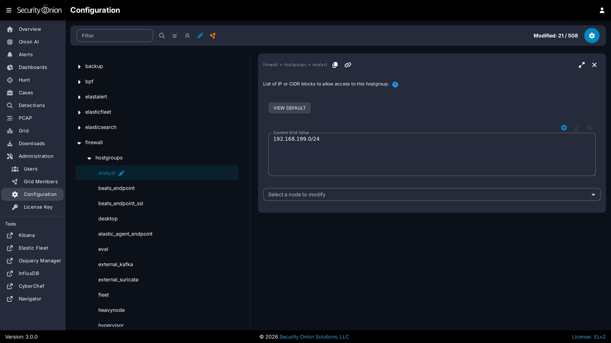

# Syslog

If you want to send syslog from other devices, you should check to see if the device has an existing [Elastic Agent](elastic-agent.md) integration. If so, using the [Elastic Agent](elastic-agent.md) integration should provide some parsing by default.

If your device does not have an existing [Elastic Agent](elastic-agent.md) integration, you can still collect standard syslog. Start by going to [Administration](administration.md) --> Configuration --> firewall --> hostgroups.

Then choose the `syslog` option to allow the port through the firewall. If sending syslog to a sensor, please see the Examples in the [Firewall](firewall.md) section. If you need to add custom parsing for those syslog logs, we recommend using [Elasticsearch](elasticsearch.md) ingest parsing.

Also note that if you're monitoring network traffic with [Zeek](zeek.md), then by default it will detect any syslog in that network traffic and log it even if that syslog was not destined for that particular Security Onion node.
