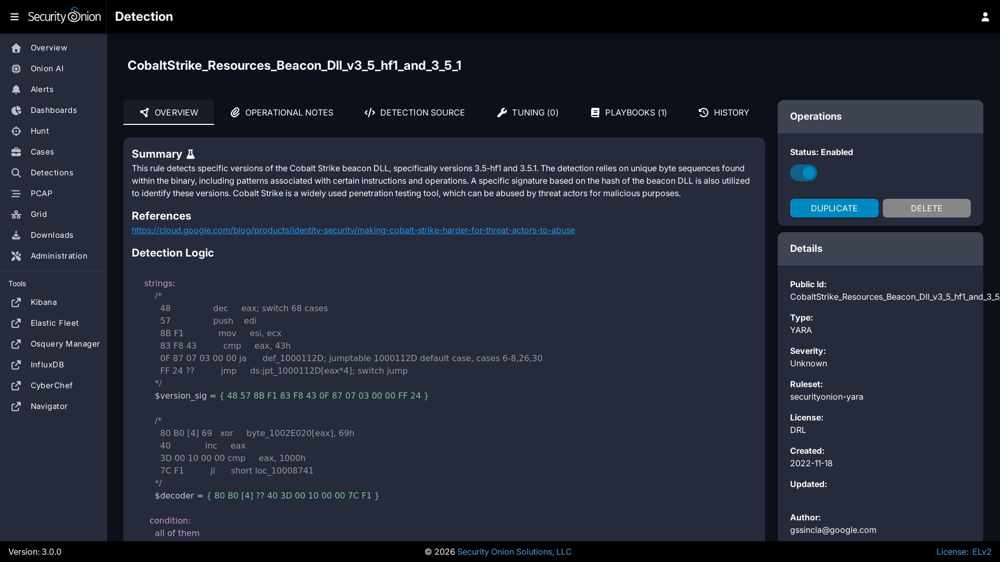
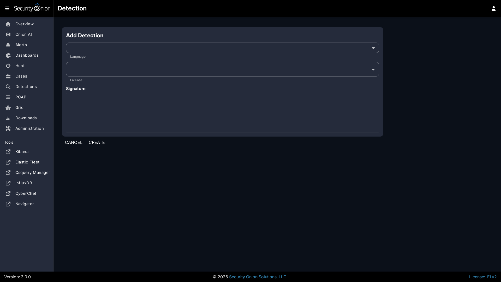

# YARA

YARA rules are loaded into [Strelka](strelka.md) to monitor files for suspicious or noteworthy characteristics. Active YARA rules generate alerts that can be found in [Alerts](alerts.md).

From <https://virustotal.github.io/yara/>:

> YARA is a tool aimed at (but not limited to) helping malware researchers to identify and classify malware samples. With YARA you can create descriptions of malware families (or whatever you want to describe) based on textual or binary patterns. Each description, a.k.a rule, consists of a set of strings and a boolean expression which determine its logic.

## Managing Existing YARA Rules

You can manage existing YARA rules via [Detections](detections.md). There are two ways to do so:

- From the main [Detections](detections.md) interface, you can search for the desired detection and click the binoculars icon.
- From the [Alerts](alerts.md) interface, you can click an alert and then click the `Tune Detection` menu item.

Once you've used one of these methods to reach the detection detail page, you can check the Status field in the upper-right corner and use the slider to enable or disable the detection.



## Adding New YARA Rules

To add a new YARA rule, go to the main [Detections](detections.md) page and click the blue + button between Options and the query bar. A form will appear where you will:

1. Click the Language drop-down and select `YARA`.
2. Optionally specify a license.
3. Add the signature.
4. Click the `CREATE` button and the detection should deploy to your grid at the next 15-minute cycle.



## YARA Rules Options

You can configure YARA rules options as follows:

- Navigate to [Administration](administration.md) --> Configuration.
- At the top of the page, click the `Options` menu and then enable the `Show advanced settings` option.
- Navigate to `SOC` --> `config` --> `server` --> `modules` --> `strelkaengine`.

Once you've reached this location, here are some common settings.

### YARA Update Frequency

By default, Security Onion checks for new YARA rules every 24 hours. You can change this value at `SOC` --> `config` --> `server` --> `modules` --> `strelkaengine` --> `communityRulesImportFrequencySeconds`.

### Custom YARA Repositories

You can configure Security Onion to pull YARA rules from custom git repos via `SOC` --> `config` --> `server` --> `modules` --> `strelkaengine` --> `rulesRepos` --> `default`. 

Repos can be accessed via https or from the local filesystem. For example:

```
file:///nsm/rules/detect-yara/repos/my-custom-rep
```